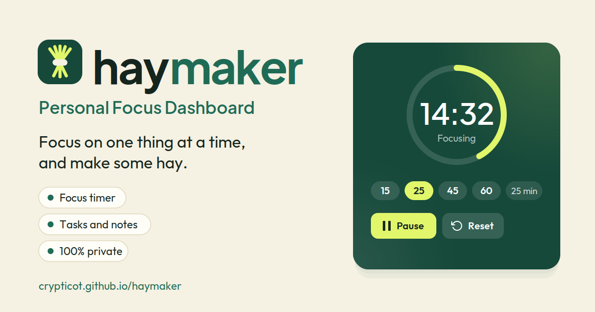

# HayMaker

HayMaker is a personal focus dashboard that keeps a session timer, a task list, and searchable notes on one page. Open it, pick a session length, and work on one thing at a time. Everything you enter is stored in your browser, so there is no account to create and nothing to sync.

**[Live Demo](https://crypticot.github.io/haymaker/)**



---

## Why this exists

Most focus tools ask for an account, a subscription, or a steady stream of notifications before they help you concentrate. The part that actually helps is small: a timer you can start in one click, a short list of what you are working on, and somewhere to drop a thought without losing your place.

HayMaker sticks to that. The whole app is a single file with no server behind it, so your tasks and notes never leave the browser. There is no sign-up, no analytics, and nothing to configure before you can start the timer.

---

## What it does

- **Focus timer**: presets for 15, 25, 45, and 60 minutes, or a custom length from 1 to 180 minutes. A ring fills as the session runs, and you can pause, resume, or reset. Your chosen length is remembered, and the length controls lock while a session is running so they cannot be changed by accident
- **Time left in the tab title**: while the timer runs, the remaining time shows in the browser tab, so you can check it from another tab
- **Focus minutes**: every finished session adds to a running total in the Today card, and a short message confirms completion
- **Tasks**: add, check off, and delete tasks. The card shows how many are still open, and the Today card tracks how many are done with a progress bar
- **Notes**: a text box that grows as you write, up to 5,000 characters, with Ctrl or Cmd + Enter to save. Saved notes show a two-line preview with Show more and Show less, and the list scrolls inside its own box so a long list never stretches the page
- **Note search**: filters as you type, highlights the matching text, and shows how many notes match
- **Reminder**: one editable line at the side of the page, set to "Make hay while the sun shines." until you change it
- **Save, Load, and Reset**: Save downloads a JSON backup. Load file checks the file, tells you how many tasks and notes it contains, and asks before replacing anything. Reset all asks before it deletes anything
- **Settings**: light or dark theme (it follows your system on the first visit), six accent colors or a custom one. The highlight color is derived from the accent, so the whole page stays in one palette
- **Works on phones**: the layout stacks into a single column on narrow screens, and it respects reduced-motion settings

---

## Tech stack

Built entirely in vanilla HTML, CSS, and JavaScript, in one file. Just open `index.html`.

- No libraries and no build step
- Browser storage (`localStorage`) keeps your data on your device
- Google Fonts: Plus Jakarta Sans (headings) + Outfit (body), with system fonts as the fallback if they cannot load

---

## Running it locally

```bash
git clone https://github.com/crypticot/haymaker.git
cd haymaker
```

Open `index.html` in any modern browser. No dependencies to install, no server required.

---

## A few design decisions worth knowing

**Why the timer reads the clock instead of counting seconds.** Browsers slow down timers in background tabs, and a timer that adds up one-second ticks drifts as soon as you switch away to do the work. HayMaker stores the moment the session should end and works out the time left from the clock on every update, so the display is still correct when you come back.

**Why saved notes show only a preview.** Notes are easy to write at length and hard to scan. A two-line preview keeps the list readable, and Show more opens only the note you want. The list also has its own scroll, so adding notes never pushes the rest of the page down.

**Why Load and Reset ask first.** Both replace everything currently in the app, and neither can be undone. Load shows how many tasks and notes the file contains before you confirm, so you can tell whether it is the right backup, and Reset points you to Save first.

**Why your data lives in the browser, and why Save exists.** Keeping data in browser storage is what makes the tool private and account-free. The tradeoff is that storage belongs to one browser on one device, and clearing site data erases it. Save gives you a backup file you control, and Load file brings it back on another device.

---

## Built by

**Chidubem Ojukwu** · [Portfolio](https://crypticot.github.io/cotworks-portfolio/) · [LinkedIn](https://linkedin.com/in/ojukwuii)

Created by COTworks. A single-file tool for anyone who wants a quiet place to focus, with nothing to sign up for.
